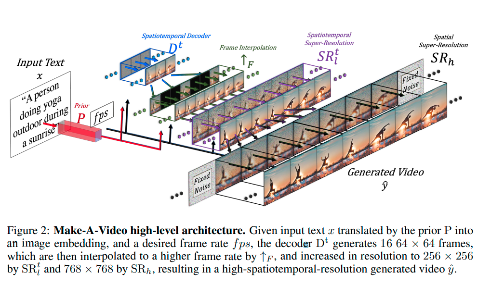
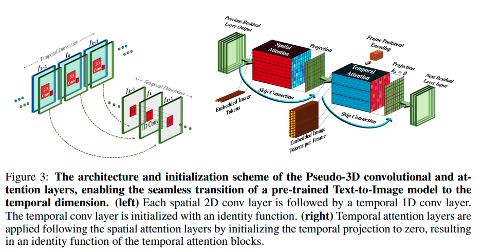

# MAKE-A-VIDEO
### TEXT-TO-VIDEO GENERATION WITHOUT TEXT-VIDEO DATA

</img>

### Main components
It consists of three main components:
1. A base T2I model trained on text-image pairs
2. spatiotemporal convolution and attention layers that extend the networks’ building
blocks to the temporal dimension
3. spatiotemporal networks that consist of both spatiotemporal layers, as well as another crucial element needed for 
T2V generation - a frame interpolation network for high frame rate generation

### Spaciotemporal layers
#### 1. Pseudo-3D convolutional layers
It stacks a 1D convolution following each 2D convolutional (conv) layer to facilitate information sharing between spacial and temporal axes with less computational power compared with 3D conv layers.

</img>

#### 2. Pseudo-3D attention layers
#### 3  Frame interpolation network
